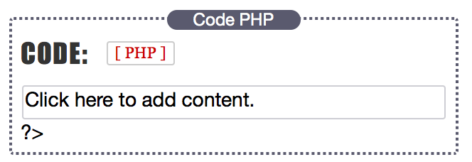

# PHP-Stack

Program in PHP with RapidWeaver Stacks? Us this stack to fix a few of the PHP problems prevalent throughout Stacks and Stacks plugins. Encase other stacks or display information coming from your database, cloud, server, etc.

Add this to your Stack page instead of using the default HTML element. The default HTML stack wraps your stack in a DIV that occasionally causes problems while using PHP, even makes RapidWeaver crash sometimes.

## Screenshots

## Contributors

- [Nick Soggin](http://www.dreamthegame.com), iSkore Development Inc.
- [Clay O'Keefe](http://www.dreamthegame.com), iSkore Development Inc.

## License

PHP Stack is released under the MIT License:

The MIT License (MIT)

Copyright (c) 2015 iSkore Development Inc.

Permission is hereby granted, free of charge, to any person obtaining a copy
of this software and associated documentation files (the "Software"), to deal
in the Software without restriction, including without limitation the rights
to use, copy, modify, merge, publish, distribute, sublicense, and/or sell
copies of the Software, and to permit persons to whom the Software is
furnished to do so, subject to the following conditions:

The above copyright notice and this permission notice shall be included in all
copies or substantial portions of the Software.

THE SOFTWARE IS PROVIDED "AS IS", WITHOUT WARRANTY OF ANY KIND, EXPRESS OR
IMPLIED, INCLUDING BUT NOT LIMITED TO THE WARRANTIES OF MERCHANTABILITY,
FITNESS FOR A PARTICULAR PURPOSE AND NONINFRINGEMENT. IN NO EVENT SHALL THE
AUTHORS OR COPYRIGHT HOLDERS BE LIABLE FOR ANY CLAIM, DAMAGES OR OTHER
LIABILITY, WHETHER IN AN ACTION OF CONTRACT, TORT OR OTHERWISE, ARISING FROM,
OUT OF OR IN CONNECTION WITH THE SOFTWARE OR THE USE OR OTHER DEALINGS IN THE
SOFTWARE.
